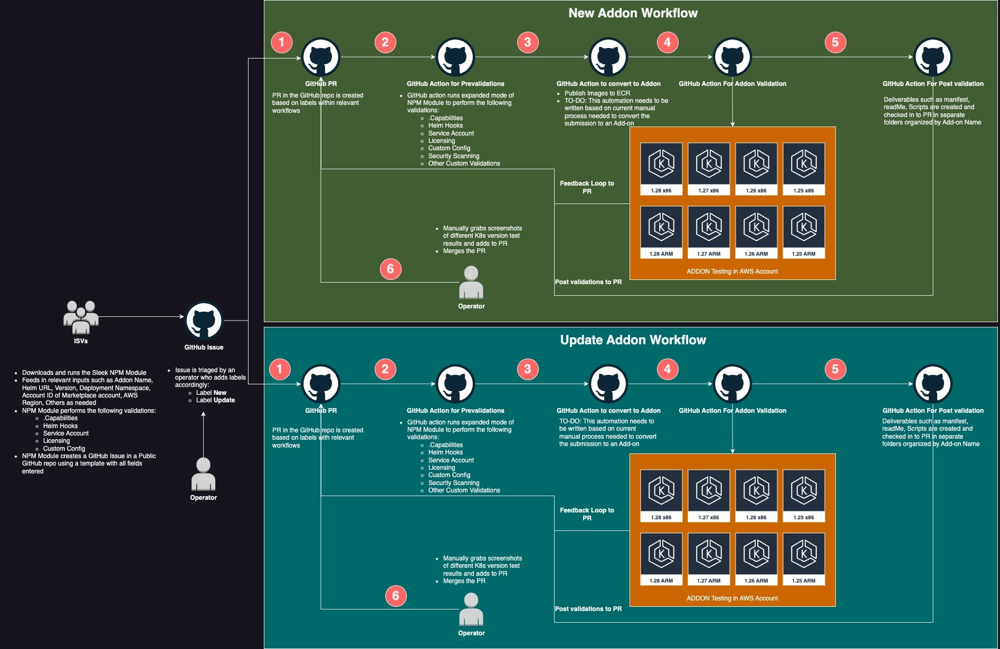

# EKS add-on onboarding user journey

## Personas:
* Vendor: ISV, AWS partner, marketplace seller of the product
* Operator: AWS or Cloudsoft engineer supporting the onboarding

## Requirements:
* `aws-sleek-transformer` cli installed on vendor environment
* Vendor GitHub handle added to the repository
* Vendor access to the helm repository
* Helm chart and images shared with the operator

## Workflow


## Guide
1. Install the aws-sleek-transformer cli following the instructions in the tool repo: https://github.com/aws-samples/addons-transformer-for-amazon-eks
2. Export a GitHub access token with 'repo' permissions for the account shared with the operator team. Token can be created at https://github.com/settings/tokens
For exporting the variable run in the terminal:
```shell
export GITHUB_TOKEN=ghp_000000000000000000000000000
```

3. Create a yaml document following the [example (TODO: update url once merged)](https://github.com/aws-samples/addons-transformer-for-amazon-eks/blob/dev/doc/examples/onboarding.example.yaml). 
The yaml document must match the [JSON schema (TODO: update url once merged)](https://github.com/aws-samples/addons-transformer-for-amazon-eks/blob/dev/schema/onboarding.schema.json) .
In order to help the vendor with the creation of a valid yaml document and a valid chart, the cli exposes a validate command that runs the same validations locally but it doesn’t try to create an issue. Check the tool readme for instructions.

4. Running the following command
```shell
aws-sleek-transformer create-issue add-on.yaml
```
pulls the chart from the helm repo and validates it. If no issues are found in the static analysis, a new issue will be opened in the onboarding GitHub repository to progress with extra validation and testing.
The onboarding process supports the automatic removal from the charts of the  features not supported by EKS. The option has to be enabled explicitly, by setting the chartAutoCorrection property to true in the yaml document. The onboarding process outputs will be available on the pull request.

5. The vendor can see the progress in the issue and the other GitHub artefacts: action execution and pull request created

6. Once all tests are correct, the generated assets will be added to the internal pull request and merged in the onboarding repo making them available to the vendor
